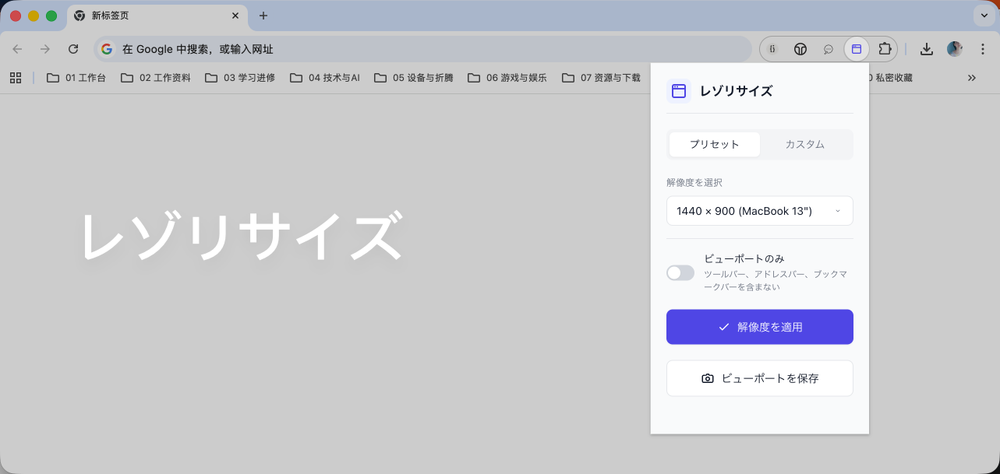

# レゾリサイズ / Reso-resizer 

スクリーンショットのサイズがバラバラで困っていませんか？完璧主義のプロダクトマネージャーと開発者のための強力な味方、登場！

Reso-resizer（レゾリサイズ）は、ミニマルでエレガントな Chrome 拡張機能です。ピクセル単位での精密な制御を追求するあなたのために生まれました。ブラウザウィンドウを任意の正確な解像度にワンクリックで調整でき、スクリーンショットの統一や、さまざまなデバイスの表示シミュレーションも簡単に実現できます。✨

🌟 核心魔法 (Features)

🎯 ピクセル単位の精密制御：目測にさようなら！目標解像度を入力するだけで、ブラウザウィンドウが瞬時に調整され、スクリーンショットのサイズが完璧に一致します。
🔄 プリセット/カスタム デュアルモード：

プリセットモード：よく使う解像度（MacBook、iPhone、iPad など）をワンクリックで選択、すぐに使用可能。
カスタムモード：任意の幅と高さを自由に入力、特殊なニーズにも対応。

🖼️ スマート Viewport モード：ウェブページの表示領域（Viewport）のみを調整するオプションを提供。ブラウザのツールバー、アドレスバー、ブックマークバーの高さを自動的に除外し、ウェブコンテンツ領域が目標サイズに正確に一致します。
📸 クイックスクリーンショット保存：現在の表示領域をそのままキャプチャし、システムの保存ダイアログから PNG として保存できます。
🌍 ネイティブ多言語対応：ブラウザの言語環境を自動認識し、中国語、日本語、英語をシームレスに切り替え。手動設定は不要です。
⚙️ 設定ファイル駆動：すべてのプリセット解像度は config.json で集中管理。設定の変更はコードを修正する必要なく、メンテナンスが超簡単。

🧩 どうやって動作するの？
Reso-resizer（レゾリサイズ）の核心原理は非常にシンプルかつ効率的です：

標準モード：Chrome API を直接呼び出し、ブラウザウィンドウ全体を指定サイズに調整。
Viewport モード：

スクリプトインジェクションで現在のウェブページの実際の表示領域サイズ（innerWidth/innerHeight）を取得。
ブラウザの枠線とツールバーが占める追加スペースを計算。
これらのスペースを自動的に補償し、最終的にウェブコンテンツ領域が目標解像度に完璧に一致するように調整。

🛠️ インストールと使用方法

方法1：Release パッケージからインストール

GitHub の `Releases` ページから最新の `reso-resizer-v*.zip` をダウンロードします。
ダウンロードした zip ファイルをローカルのフォルダへ解凍します。
Chrome ブラウザを開き、`chrome://extensions/` にアクセスします。
右上の「デベロッパーモード」をオンにします。
「パッケージ化されていない拡張機能を読み込む」をクリックし、解凍したフォルダを選択します。
ブラウザツールバーの Reso-resizer アイコンをクリックして使い始めます。

方法2：ソースフォルダからインストール

本リポジトリをダウンロードまたはクローンします。
Chrome ブラウザを開き、`chrome://extensions/` にアクセスします。
右上の「デベロッパーモード」をオンにします。
「パッケージ化されていない拡張機能を読み込む」をクリックし、本プロジェクトのフォルダを選択します。
ブラウザツールバーの Reso-resizer アイコンをクリックして、精密制御を開始します。

⚙️ 設定をカスタマイズするには？
すべての設定は config.json ファイルに集中しています：

プリセット解像度の追加/変更：presets 配列でオプションを増減し、多言語ラベルに対応。
デフォルト解像度の変更：defaultResolution の値を調整。
Viewport モードをデフォルトでオン：defaultViewportOnly を true に設定。

設定ファイルには詳細な多言語コメントが含まれており、一目で理解できます！

📄 オープンソースライセンス
MIT License - 自由に使用し、貢献を歓迎します！

---

すべてのスクリーンショットを完璧に統一する、Reso-resizer（レゾリサイズ）から始めましょう！🚀
