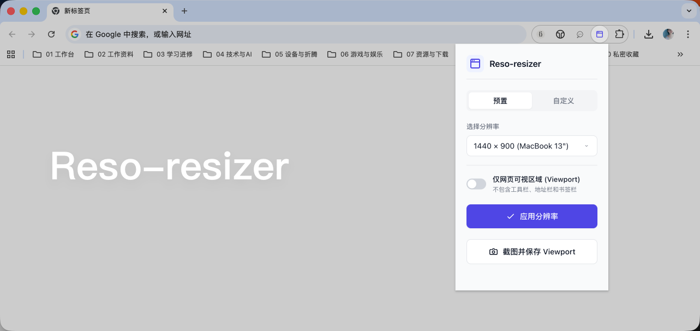
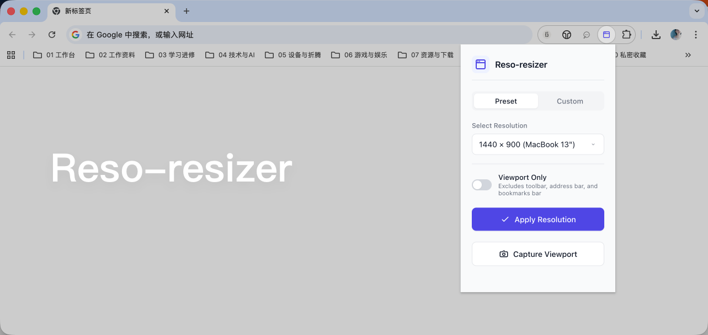

# Reso-resizer / レゾリサイズ

[日本語版 README](./README.ja.md)

## 中文

还在为截图尺寸不统一而发愁吗？这是给强迫症产品经理和开发者准备的 Chrome 插件。

Reso-resizer（レゾリサイズ）是一个极简的浏览器窗口尺寸调整工具，可以一键把浏览器窗口改成精确分辨率，用来统一截图规范或模拟不同设备显示效果。当前版本：`v1.0.5`。

### 功能特点

- 逻辑像素精准控制：输入的是浏览器逻辑尺寸（CSS px / device-independent pixels），而不是 Retina 屏幕上的物理像素。
- 预置和自定义双模式：可直接选择常用桌面、手机和平板尺寸，也可以手动输入任意宽高。
- 智能 Viewport 模式：只调整网页可视区域尺寸，自动排除工具栏、地址栏等浏览器界面占用空间。
- 即时模式切换：Viewport 开关开启或关闭后，会自动按切换后的模式重新应用分辨率。
- 快速截图保存：可直接截取当前可视区域，并调用系统保存对话框将截图保存为 PNG 文件。
- 原生多语言支持：根据浏览器语言自动切换中文、日语和英文。
- 智能状态记忆：自动记住上次使用的 preset、custom 宽高、模式和 Viewport 设置，下次打开插件时自动恢复。
- 配置文件驱动：所有预置分辨率集中放在 `config.json` 中，维护时不需要改代码。

### 工作原理

- 标准模式：直接通过 Chrome API 调整整个浏览器窗口大小。
- Viewport 模式：
  - 通过 `innerWidth` 和 `innerHeight` 获取当前网页可视区域尺寸。
  - 计算浏览器边框和工具栏占用的额外空间。
  - 自动补偿这些空间，让网页内容区域最终准确匹配目标分辨率。
- 尺寸与导出：自定义宽高使用浏览器逻辑像素；截图导出时会根据设备像素比转换为物理像素。例如在 Retina 2x 屏幕上，输入 `1280 × 900` 会导出为 `2560 × 1800`。

### 安装使用

方式一：通过 Release 包安装

1. 在 GitHub 的 `Releases` 页面下载最新的 `reso-resizer-v*.zip` 安装包。
2. 将下载的 zip 文件解压到本地文件夹。
3. 打开 Chrome，进入 `chrome://extensions/`。
4. 开启右上角的 `开发者模式`。
5. 点击 `加载已解压的扩展程序`，选择刚刚解压后的文件夹。
6. 点击浏览器工具栏中的 Reso-resizer 图标开始使用。

方式二：通过源码目录安装

1. 下载或克隆本仓库。
2. 打开 Chrome，进入 `chrome://extensions/`。
3. 开启右上角的 `开发者模式`。
4. 点击 `加载已解压的扩展程序`，选择当前项目目录。
5. 点击浏览器工具栏中的 Reso-resizer 图标开始使用。

### 配置说明

所有配置都在 `config.json` 中。

- 在 `presets` 数组中添加或修改预置分辨率。
- 用 `defaultResolution` 修改默认分辨率。
- 将 `defaultViewportOnly` 设为 `true` 可默认开启 Viewport 模式。
- `language` 设为 `auto` 时，会根据 `navigator.language` 自动选择界面语言。

自定义模式中的宽度和高度会持久化保存；关闭浏览器后再次打开扩展，仍会恢复上次输入的数值。Viewport 开关状态也会一并恢复。

### 开源协议

MIT License，详见 [`LICENSE`](./LICENSE)。

---

## English

Tired of inconsistent screenshot sizes? A blessing for perfectionist product managers and developers.

Reso-resizer (レゾリサイズ) is a minimalist Chrome extension for precise browser resizing. With one click, you can resize your browser window to an exact logical resolution for standardized screenshots or device display simulation. Current version: `v1.0.5`.

### Features

- Logical-pixel control: Enter browser logical dimensions (CSS px / device-independent pixels), rather than physical Retina pixels.
- Preset and custom modes: Choose common desktop, phone, and tablet sizes, or enter any width and height manually.
- Smart viewport mode: Resize only the webpage viewport while automatically excluding browser UI such as toolbars and the address bar.
- Instant mode switching: Toggling Viewport mode on or off immediately reapplies the resolution using the new mode.
- Quick viewport capture: Capture the current visible viewport and save it as a PNG file through the system save dialog.
- Native multilingual support: Automatically switches between Chinese, Japanese, and English based on the browser language.
- Smart state memory: Automatically remembers the last preset, custom dimensions, mode, and Viewport setting, restoring them when reopening the extension.
- Configuration-driven presets: Manage all preset resolutions centrally in `config.json` without changing code.

### How It Works

- Standard mode: Uses the Chrome API to resize the full browser window directly.
- Viewport mode:
  - Reads the current webpage viewport size with `innerWidth` and `innerHeight`.
  - Calculates the extra space taken by browser chrome.
  - Applies compensation so the visible content area matches the target resolution exactly.
- Size and export: Custom dimensions use browser logical pixels. Screenshot output is converted according to the device pixel ratio; on a Retina 2x display, `1280 × 900` exports as `2560 × 1800`.

### Installation

Option 1: Install from the release package

1. Download the latest `reso-resizer-v*.zip` file from the GitHub `Releases` page.
2. Extract the downloaded zip file to a local folder.
3. Open Chrome and go to `chrome://extensions/`.
4. Enable `Developer mode`.
5. Click `Load unpacked` and select the extracted folder.
6. Click the Reso-resizer icon in the browser toolbar.

Option 2: Install from the source folder

1. Download or clone this repository.
2. Open Chrome and go to `chrome://extensions/`.
3. Enable `Developer mode`.
4. Click `Load unpacked` and select this project folder.
5. Click the Reso-resizer icon in the browser toolbar.

### Configuration

All configuration is stored in `config.json`.

- Add or modify preset resolutions in the `presets` array.
- Change the default resolution with `defaultResolution`.
- Enable viewport mode by default with `defaultViewportOnly: true`.
- Set `language` to `auto` to choose the UI language from `navigator.language`.

Custom width, height, mode, preset, and Viewport settings are persisted locally and restored when the extension is reopened, even after the browser is closed.

### License

MIT License; see [`LICENSE`](./LICENSE).
